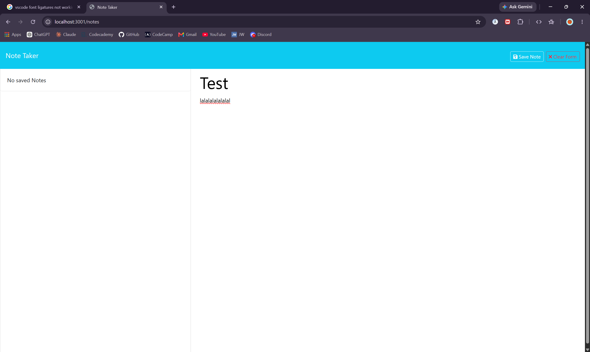
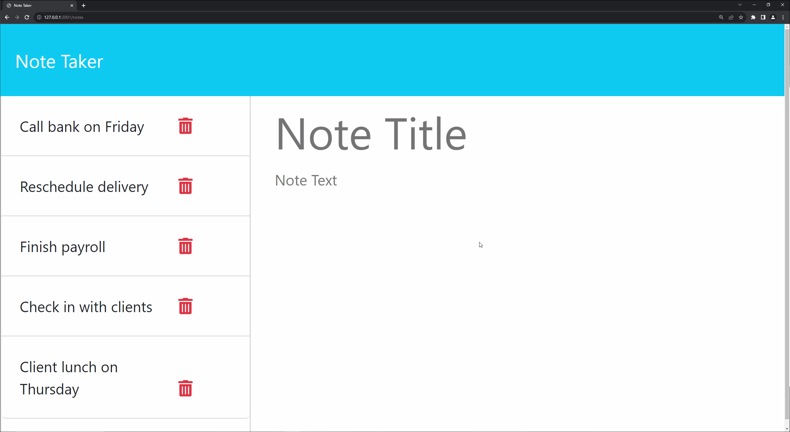

# Note Taking

## Description

This is just a simple note taking app to jot down some quick thoughts. You will see other peoples notes so please don't spam or jot innapropiate jokes.




## Table of Contents

- [Dependecies](#dependencies)
- [Installation](#installation)
- [Usage](#usage)
- [Commands](#command)
- [Questions](#questions)

## Dependencies

nodejs v26

## Installation

```
git clone https://github.com/Cinnabonmon/Notes-Taker.git
```

## Commands

```
cd Notes-Taker
npm i
node ./server.js
```

## Usage

If you would like to use on your own machine just clone from the install command above and just run it as a server locally. It listens to port 3001 so make sure thats its free.

## Questions

- Github: Cinnabonmon
- Email: justincollins2580@gmail.com
